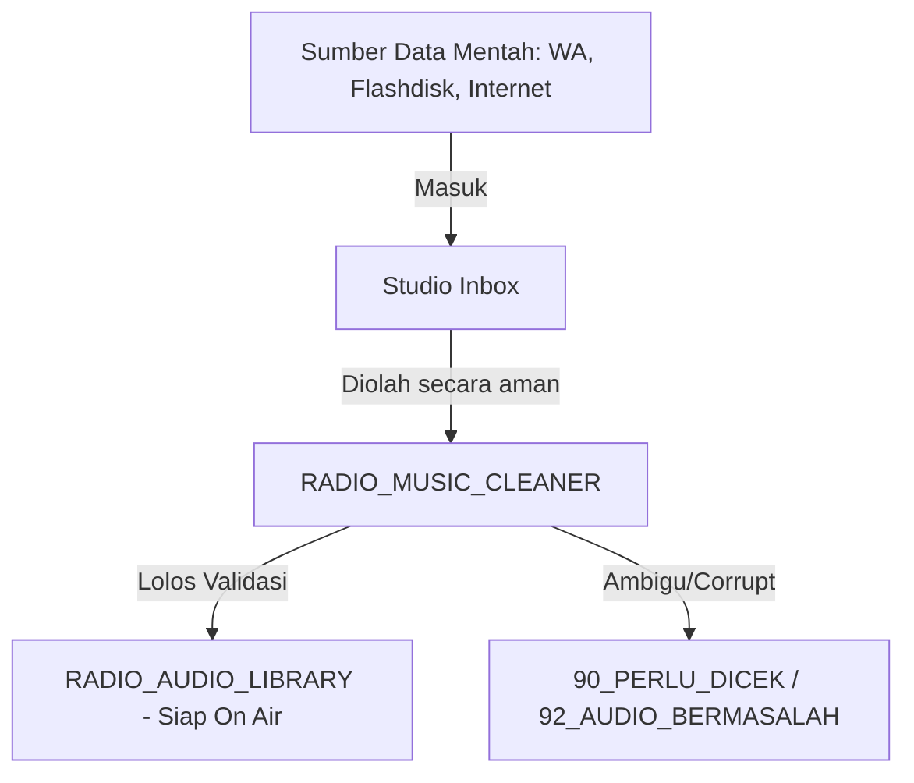

# Analisis & Penataan Folder Studio Inbox — RADIO_MUSIC_CLEANER

Dokumen ini berisi analisis mendalam mengenai fungsi, sumber data, dan strategi penataan folder **Studio Inbox** (direktori utama penerimaan file audio mentah di PC studio radio publik lokal).

---

## 1. Analisis Fungsi Studio Inbox

Folder **Studio Inbox** bertindak sebagai "gerbang utama" (inbox) penampung seluruh berkas audio mentah eksternal sebelum didistribusikan ke pustaka lagu siaran resmi (`RADIO_AUDIO_LIBRARY`).

### Karakteristik Masalah di Studio Inbox:
* **Nama Berkas Sangat Kotor**: Hasil konversi online, nama default rekaman, atau string acak dari media sosial.
* **Metadata Kosong/Salah**: Tidak memiliki tag artis dan judul yang valid untuk dibaca oleh aplikasi playlist (seperti RadioBoss).
* **Format Berkas Beragam**: Campuran dari `.mp3`, `.wav`, `.m4a`, hingga `.ogg` dan `.opus` (rekaman WhatsApp).

---

## 2. Analisis Sumber Data Studio Inbox

Berkas di dalam Studio Inbox diklasifikasikan berdasarkan 4 sumber data utama:

| Sumber Data | Contoh Format Nama Asli | Permasalahan Utama | Kategori Target Akhir |
| :--- | :--- | :--- | :--- |
| **WhatsApp Web / Desktop** | `WhatsApp Audio 2026-05-31 at 14.30.22.mp3` `AUD-20260531-WA0002.opus` | Format tidak seragam, audio VN berupa opus (tidak didukung beberapa pemutar), tanpa metadata. | `90_PERLU_DICEK` atau `05_PROGRAM_REKAMAN/Wawancara` |
| **Internet / Youtube Downloader** | `Andmesh - Cinta Luar Biasa (Official Video) 320kbps.mp3` `JINGLE_RRI_converted.mp3` | Mengandung frasa promosi, kualitas bitrate tidak sesuai klaim nama file, spasi ganda atau underscore. | `02_MUSIK_INDONESIA/Pop_Indonesia` atau `04_NON_MUSIK_SIARAN/Jingle_Station_ID` |
| **Rekam Siaran / Talkshow** | `dialog_publik_kesehatan_fix.wav` `talkshow_31_mei.mp3` | Durasi sangat panjang (>15 menit), tanpa metadata tag, file berukuran besar. | `05_PROGRAM_REKAMAN/Talkshow` |
| **Flashdisk Penyiar / Tamu** | `Track 01.mp3` `Lagu Baru Enak.mp3` `Unknown_Artist.mp3` | Informasi nama berkas tidak jelas, rawan membawa berkas duplikat yang sudah ada di library. | `90_PERLU_DICEK` atau `91_DUPLIKAT_DIDUGA` |

---

## 3. Strategi Perapian Otomatis oleh System

Untuk merapikan Studio Inbox secara presisi, **RADIO_MUSIC_CLEANER** menerapkan aturan penyaringan khusus:

### A. Penanganan Berkas WhatsApp
Sistem mendeteksi substring `whatsapp` atau pola `AUD-` / `PTT-` pada nama file:
1. **Rename**: Mengubah nama acak WhatsApp menjadi format seragam, contoh: `WhatsApp Audio 2026-05-31 at 14.30.22.mp3` -> `WhatsApp Audio 20260531.mp3`.
2. **Metadata**: Tag Artist diisi `WHATSAPP` dan Album diisi `WhatsApp Audio Inbox` untuk mempermudah pelacakan.
3. **Sorting**: Otomatis diarahkan ke `90_PERLU_DICEK` guna mencegah Voice Note pendengar terputar sebagai lagu di playlist siaran.

### B. Pembersihan Frasa Konverter & Bitrate
Mengacu pada `config/cleaner_rules.json`:
1. Menghapus frasa `official video`, `video lirik`, `free download`, `youtube`, `converted`, dll.
2. Menghapus klaim bitrate palsu seperti `320kbps`, `128kbps` pada nama file.
3. Mengubah pemisah underscore (`_`) menjadi spasi tunggal yang rapi.

### C. Pemisahan Berkas Berdurasi Ekstrem
Berdasarkan analisis durasi audio (`audio_reader.py`):
* **Durasi < 10 detik**: Diarahkan ke folder `04_NON_MUSIK_SIARAN/Jingle_Station_ID` atau `90_PERLU_DICEK` (kemungkinan file sfx/potongan rusak).
* **Durasi > 15 menit**: Diarahkan otomatis ke `05_PROGRAM_REKAMAN/Talkshow` (bukan Pop Indonesia, untuk mencegah pemutaran file panjang di tengah program lagu).

---

## 4. Alur Kerja Operator Merapikan Studio Inbox

Operator cukup menjalankan aplikasi lewat Menu Interaktif (`run.bat`):
1. Pilih **Menu 1 (Ubah Folder Input)** -> Masukkan alamat folder Studio Inbox Anda (misalnya `C:\Users\User\Downloads` atau `D:\Studio_Inbox`).
2. Pilih **Menu 4 (Audit Mode Aman)** -> Cek laporan preview nama baru dan duplikat untuk memastikan keamanan.
3. Pilih **Menu 5, 6, dan 7** secara berurutan untuk menyalin, menulis metadata, dan menyortir file ke folder Rapi.
4. Buka folder `data/output/RADIO_AUDIO_LIBRARY/` untuk memindahkan file siap siar ke folder `00_ON_AIR_READY`.
